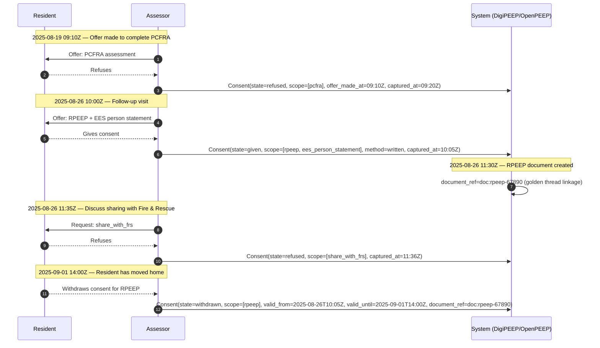

# Consent Lifecycle

This document illustrates how consent records are captured, updated, and withdrawn within the OpenPEEP Standard.  
It is intended as explanatory guidance for implementers, auditors, and responsible persons.  
It complements the [Consent schema](../schemas/common/consent.schema.json).

---

## Purpose

Consent records ensure that a resident’s wishes are clearly captured, auditable, and portable across systems.  
They support compliance with:

- Fire Safety (Residential Evacuation Plans) (England) Regulations 2025 (from April 2026)  
- Regulatory Reform (Fire Safety) Order 2005  
- Building Safety Act 2022 (golden thread)  
- Equality Act 2010 (reasonable adjustments)  
- Approved Document B (Fire Safety)  
- NFCC Person-Centred Fire Risk Framework  

Consent records are **not** an access control or permissions system. They are **legal audit artefacts**.

---

## Consent States

| State       | Meaning (audit)                                                                 | Typical fields present                                         | Example `scope`                  | `document_ref`?                        |
|-------------|----------------------------------------------------------------------------------|-----------------------------------------------------------------|----------------------------------|----------------------------------------|
| `refused`   | Offer made; resident **did not** grant consent                                  | `captured_at`, `captured_by`, `scope`, `offer_made_at`, reason? | `["pcfra"]`, `["share_with_frs"]`| Usually **no** (no document created)   |
| `given`     | Consent **granted** for specified scope(s)                                      | `captured_at`, `captured_by`, `scope`, method/evidence?         | `["rpeep","ees_person_statement"]`| Optional (add once artefact exists)    |
| `withdrawn` | Consent **previously given** but now cancelled (end of validity)                | `captured_at`, `captured_by`, `scope`, `valid_from/valid_until` | `["rpeep"]`, `["peep"]`          | Often **yes** (to tie to the record)   |

---

## Timeline Example (Mermaid)



---

## Event Log (JSON Lines)

```json
{"state":"refused","captured_at":"2025-08-19T09:20:00Z","captured_by":"assessor:john.smith@provider.org","scope":["pcfra"],"method":"verbal","reason":"Resident declined assessment today.","offer_made_at":"2025-08-19T09:10:00Z","person_ref":"person:12345"}

{"state":"given","captured_at":"2025-08-26T10:05:00Z","captured_by":"assessor:john.smith@provider.org","scope":["rpeep","ees_person_statement"],"method":"written","evidence_ref":"https://provider.org/evidence/consent-abc.pdf","valid_from":"2025-08-26T10:05:00Z","person_ref":"person:12345"}

{"state":"refused","captured_at":"2025-08-26T11:36:00Z","captured_by":"assessor:john.smith@provider.org","scope":["share_with_frs"],"reason":"Resident does not consent to external sharing.","offer_made_at":"2025-08-26T11:30:00Z","person_ref":"person:12345"}

{"state":"withdrawn","captured_at":"2025-09-01T14:00:00Z","captured_by":"assessor:jane.doe@provider.org","scope":["rpeep"],"reason":"Resident moved to ground-floor property.","valid_from":"2025-08-26T10:05:00Z","valid_until":"2025-09-01T14:00:00Z","person_ref":"person:12345","document_ref":"doc:rpeep-67890"}
```

---

## Key Points for Implementers

- **Immutable records**: Each consent record is standalone. A new record supersedes prior state.  
- **No medical data**: Only decision provenance. Impairments or needs belong in Person Profile / PCFRA, not here.  
- **Audit trail**: Systems should retain the full chain (refused → given → withdrawn) for golden thread compliance.  
- **Data minimisation**: Use `document_ref` only when a concrete artefact exists.  
- **Partial scopes**: Supported. A resident may consent to an RPEEP but refuse to share with FRS.  
